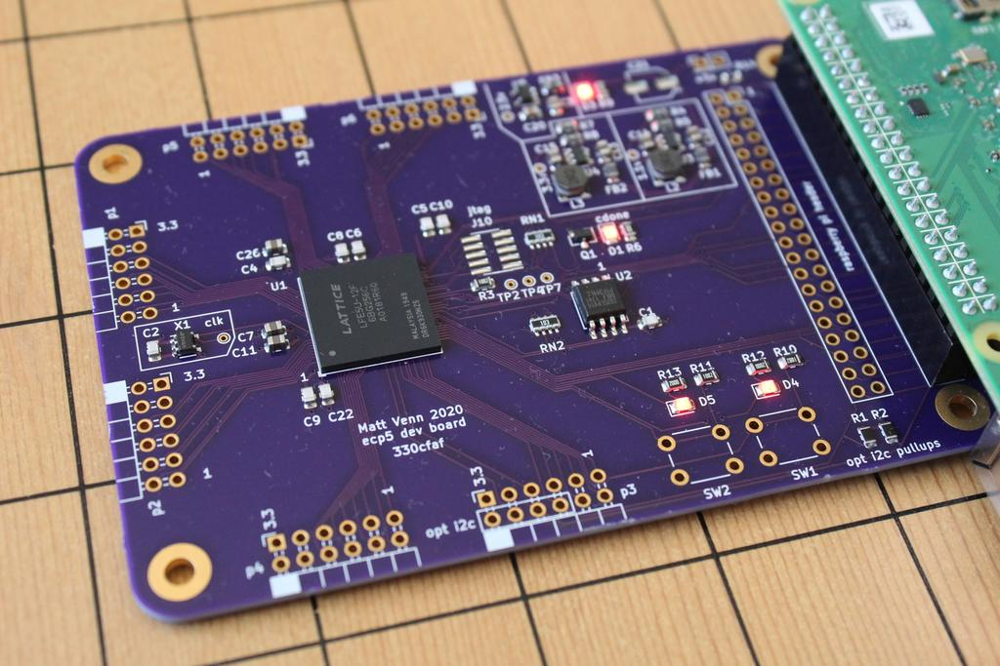

# Aim

* Make an ECP5 FPGA dev board
* Keep it super simple and cheap
* Configured by on-board FLASH or direct with a Raspberry Pi
* 6 PMODs, 2 buttons, 2 LEDs, FLASH for configuration bitstreams.

# What a Lattice ecp5 FPGA needs

Check ECP5 family datasheet for more information.

* A clock input. Has to be provided by an oscillator, it doesn't have a crystal driver. Has to go to a PCLK pad
* 1.1v core supply for the internal logic. Should supply at least 600mA
* 2.5v auxiliary power supply. Should supply 10mA
* 3.3v IO supply for the IO pins. In this design, all banks of IO have the same supply. Same PSU is used for all PMODs, and is rated at 1A.
* Get configured over SPI interface. This can be done directly by a microcontroller or a computer, or the bitstream can be programmed into some FLASH, and the FPGA will read it at boot. If FLASH isn't provided then the bitstream needs to be programmed at every power up or configuration reset. See sysconfig documentation for more info.
* Decoupling capacitors for each IO bank.

# PCB

* [Schematic](hardware/schematic.pdf)
* TODO [OHSPark project]() 
* [Gerbers](hardware/basic-ecp5-pcb-2020-07-17-fab.zip)
* 4 layer board: signal, gnd, 3.3v signal

# BOM

* FPGA ecp5 45k part, 14mm bga with 256 pins, 0.8mm pitch, $15 LFE5U-45F-6BG256C 
* 2 x TLV62568 DC/DC switchers for core (1.1v) and IO (3.3v).
* 2.5v reg TLV73325PDBVT
* 12MHz oscillator SIT2001BI-S2-33E-12.000000G
* 16MB FLASH IS25LP016D-JBLE (optional??).

# Design Review

* core supply (1.1v) is now DC/DC for 1A using TLV62568
* pmod and IO supply is now DC/DC for 1A using TLV62568
* move ferrite beads to input side of psu
* pullups on io2/3 of flash
* pulldown on tclk of jtag
* fix vias under bga by moving to 0.25mm drill 0.45mm annular ring
* add more ground vias under BGA

# RPi connection info

TODO

* serial
* i2c
* gpios
* spi & 2 x ce

# Test: 

TODO

# Reference

* http://www.latticesemi.com/ecp5
* In particular, the ECP5 and ECP5-5G Hardware Checklist is very useful

# Inspiration

* https://github.com/Spritetm/hadbadge2019_pcb
* https://github.com/gregdavill/OrangeCrab
* https://www.crowdsupply.com/radiona/ulx3s

# License

This project is licensed under the [Permissive CERN open hardware license v2](cern_ohl_p_v2.txt)
